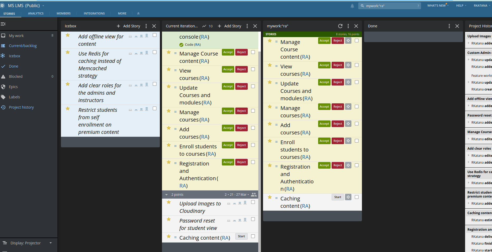
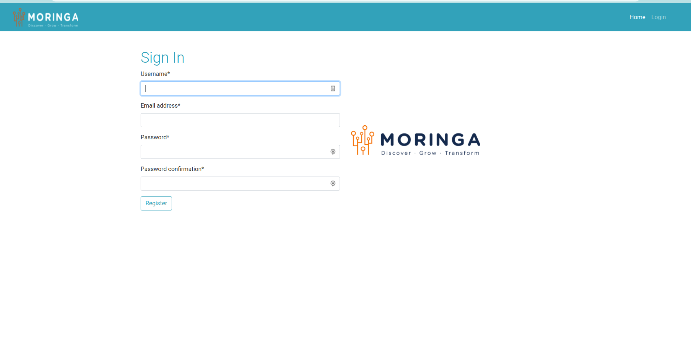
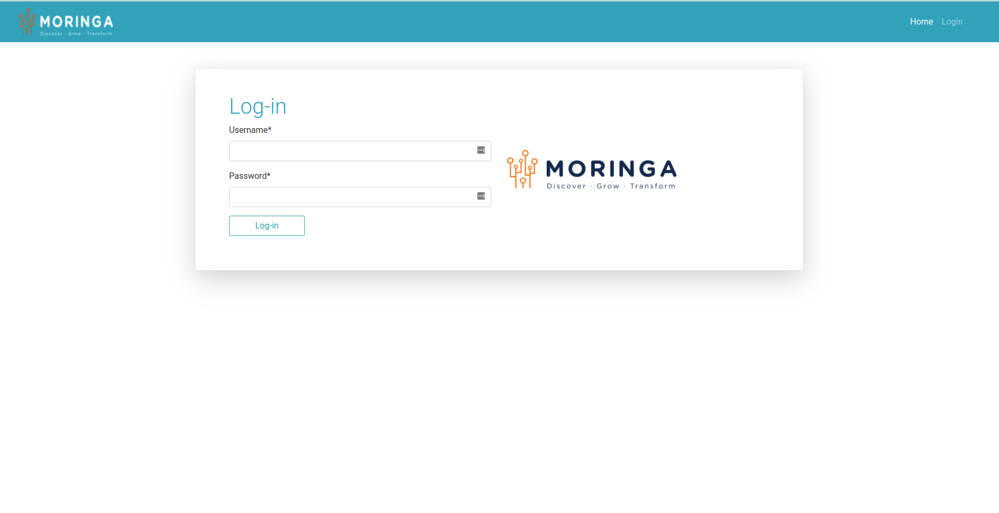
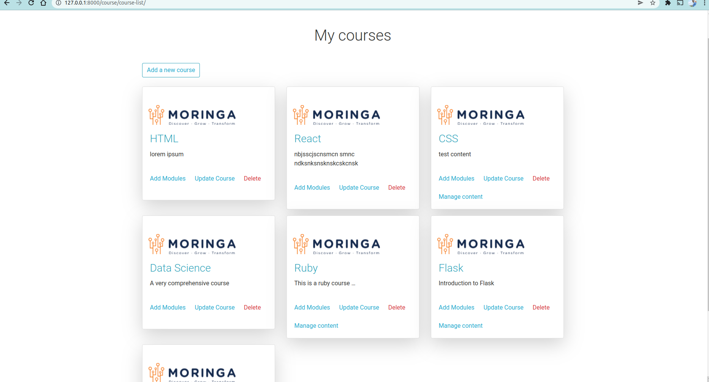
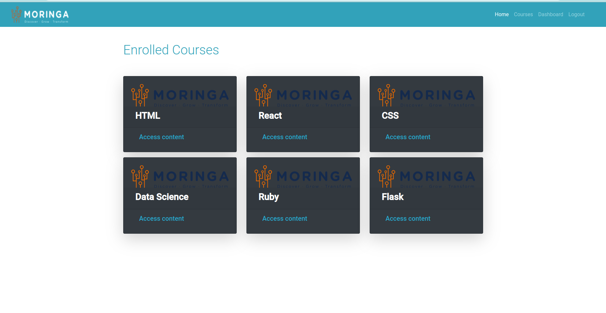
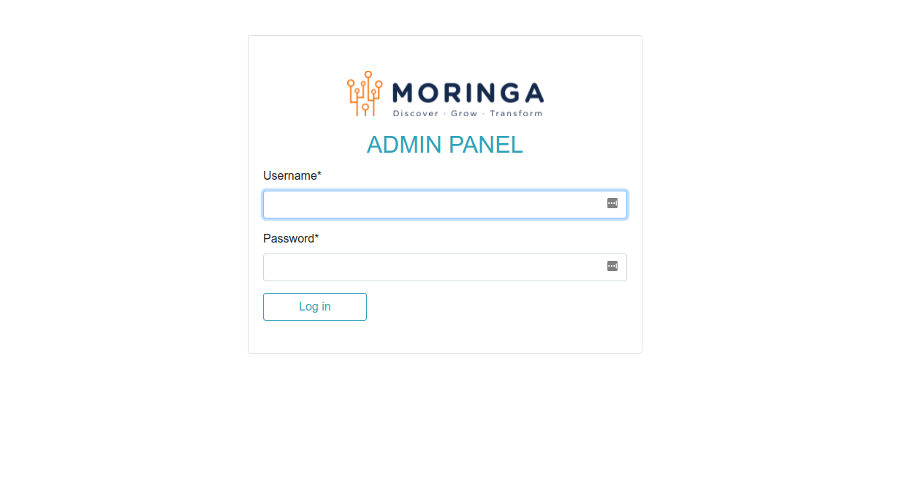
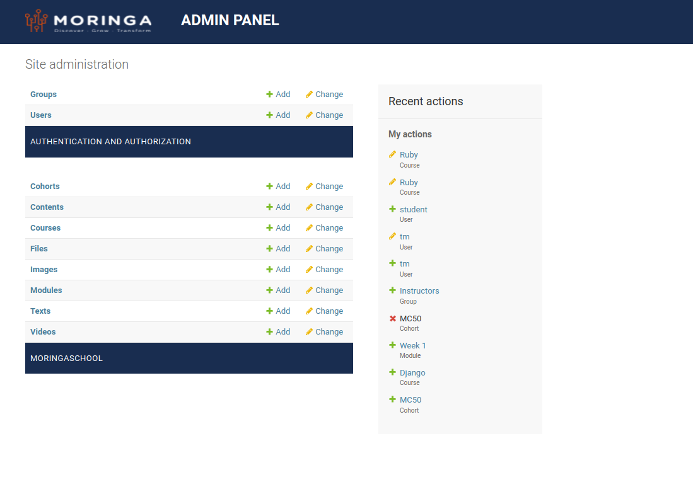

# MS LMS

### Creator [Raphael Katana]('https://github.com/users/RKatana')
An open sourece Moringa school learning management system

## Project Board 
---
Check out the project board for tasks and features on [Pivotal Tracker]('https://www.pivotaltracker.com/n/projects/2558537')

## Technologies and Packages Used
---
- Python
- Django
- Pillow
- Pipenv
- SQL
- Whitenoise
- Cloudinary
- Django Embed Video
- Django Registration
- Django braces

## Set up and Installation
- `git clone git@github.com:RKatana/ms-lms.git`
- `cd ms-lms; pipenv shell; pipenv install` #This commands basically navigates you to the cloned repo, creates a virtual environment using pipenv and the installs the dependencies from *Pipfile.lock*
- `touch .env` #create a dotenv file and then configure it to match the *.env-sample* file 
- `source .env` #source the .env to load the environment variables
- `make server` #run the development server and open the link in your browser

#### Installation Assumptions
- The above instructions assumes you are using a Unix based OS.
- I also assume that you have pipenv installed.

### App Screenshots
---

### Licence: [BSD]('./LICENSE')